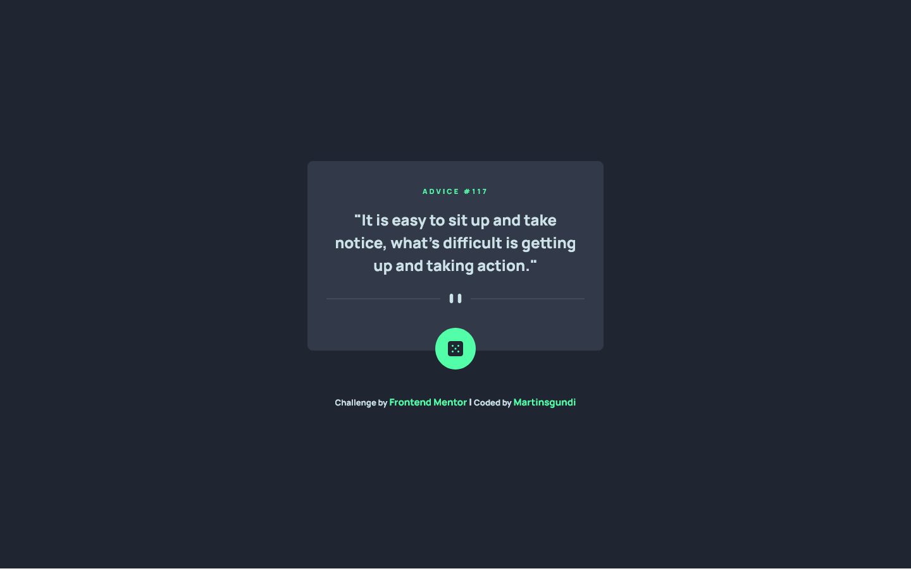
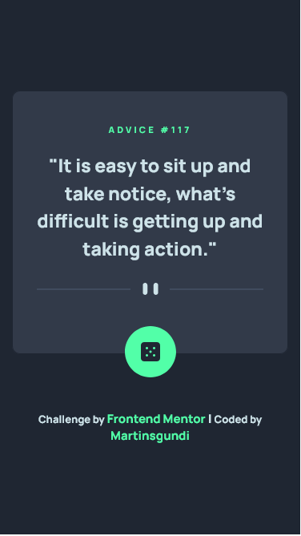

# Frontend Mentor - Advice generator app solution

This is a solution to the [Advice generator app challenge on Frontend Mentor](https://www.frontendmentor.io/challenges/advice-generator-app-QdUG-13db). Frontend Mentor challenges help you improve your coding skills by building realistic projects.

## Table of contents

- [Overview](#overview)
  - [The challenge](#the-challenge)
  - [Screenshot](#screenshot)
  - [Links](#links)
- [My process](#my-process)
  - [Built with](#built-with)
  - [What I learned](#what-i-learned)
  - [Continued development](#continued-development)
  - [Useful resources](#useful-resources)
- [Author](#author)
- [Acknowledgments](#acknowledgments)

## Overview

### The challenge

Users should be able to:

- View the optimal layout for the app depending on their device's screen size
- See hover states for all interactive elements on the page
- Generate a new piece of advice by clicking the dice icon

### Screenshot

### Links

- Solution URL: [Check out the solution on Frontend Mentor](https://your-solution-url.com)
- Live Site URL: [Visit the live site](https://your-live-site-url.com)

## My process

### Built with

- Semantic HTML5 markup
- CSS custom properties
- Flexbox
- CSS Grid
- Mobile-first workflow
- Vanilla Js

### What I learned

This project was a test of the knowledge I had just gained on consuming APIs and its functionality in general. I really enjoyed building this project, as it confirmed the knowledge I gained from the tutorials I watched on asynchronous JavaScript and APIs.

### Continued development

I am definitely looking forward to working with APIs and similar technologies in future projects to gain a better understanding of the many great things I can accomplish with them.

### Useful resources

- [Net ninja: async Js](https://www.example.com) - This helped me understand asynchronous JavaScript and how it works under the hood. It provided me with a solid foundation, and I recommend this video to anyone who is new to asynchronous JavaScript.
- [Net ninja: JSON-server](https://www.example.com) - This is also an amazing video. This tutorial walks you through all the processes of consuming an API and using the data obtained to manipulate the DOM. It was indeed a plus for me.

## Author

- Linkedin - [Martins Ogundipe](https://www.linkedin.com/in/martinsgundi)
- Frontend Mentor - [Martinsgundi](https://www.frontendmentor.io/profile/Martinsgundi)
- Twitter - [Martinsgundi1](https://www.twitter.com/martinsgundi1)

## Acknowledgments

I would like to express my appreciation to the Net Ninja YouTube channel's team for their great effort in producing wonderful videos that are incredibly easy to understand.